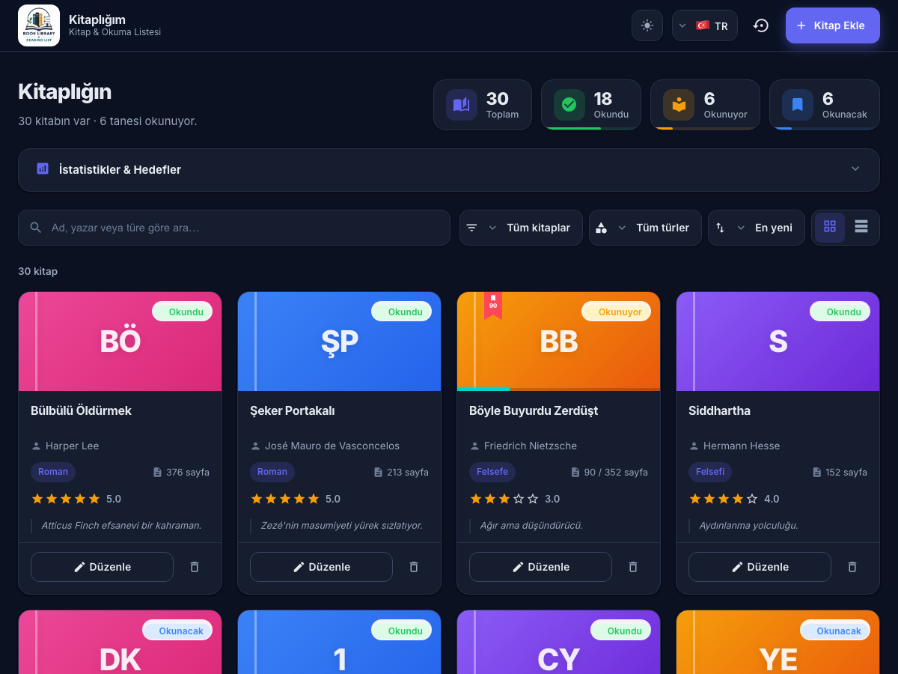
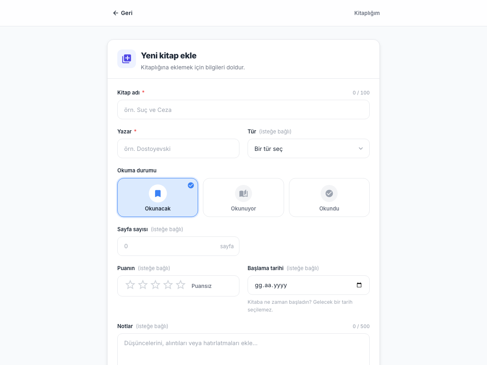

# 📚 Kitaplık ve Okuma Listesi

Angular 19 + localStorage tabanlı kişisel kütüphane uygulaması. Kullanıcı okuduğu, okuyacağı ve okumakta olduğu kitapları takip edebilir; kitap ekleyip düzenleyebilir, silebilir, puanlayabilir, türlerine/durumlarına göre filtreleyip arayabilir ve sıralayabilir.

Arayüz **Türkçe / İngilizce** dil desteğine sahiptir (sağ üstten anında değişir) ve tamamen responsive'dir.

---

## 🖼️ Ekran Görüntüleri

| Kitap listesi (dashboard, kart görünümü) | Kitap ekleme formu |
| --- | --- |
|  |  |

---

## 🚀 Kurulum

> Bu proje **Node.js 22 (LTS)** ile geliştirilmiştir. Angular tek (LTS olmayan) Node sürümlerini desteklemez.

```bash
# Bağımlılıkları yükle
npm install

# Geliştirme sunucusunu başlat
ng serve        # veya: npm start
```

Ardından tarayıcıda `http://localhost:4200` adresini aç. Uygulama otomatik olarak `/kitaplar` sayfasına yönlenir.

```bash
# Üretim derlemesi
ng build
```

---

## 🧭 Sayfalar ve Rotalar

| Rota | Açıklama |
| --- | --- |
| `/kitaplar` | Tüm kitapların listelendiği ekran (arama, filtre, sıralama, kart/tablo görünümü, sayfalama). |
| `/kitaplar/ekle` | Yeni kitap ekleme formu (reactive form). |
| `/kitaplar/:id/duzenle` | Mevcut kitabı düzenleme formu. |

Tüm feature rotaları **lazy loading** ile yüklenir (`loadChildren` + `loadComponent`).

---

## 🏛️ Mimari

Proje **feature-based** mimari ile kurgulanmıştır:

```
src/app/
├── core/                         # Uygulama geneli servis, guard, model
│   ├── services/
│   │   ├── storage.service.ts    # localStorage'a TEK erişim noktası
│   │   ├── i18n.service.ts       # signal tabanlı TR/EN çeviri servisi
│   │   ├── theme.service.ts      # açık/koyu tema (dark mode) servisi
│   │   └── translations.ts       # tr/en çeviri sözlüğü
│   ├── guards/
│   │   └── unsaved-changes.guard.ts   # canDeactivate guard
│   └── models/
│       └── language.model.ts
├── shared/                       # Yeniden kullanılabilir yapı taşları
│   ├── components/
│   │   ├── data-table/           # generic, sıralanabilir ortak tablo
│   │   ├── confirm-dialog/       # ortak "Emin misiniz?" modalı
│   │   ├── form-field/           # etiket + input + hata mesajı + karakter sayacı
│   │   ├── empty-state/          # boş durum
│   │   ├── loading-spinner/      # yükleniyor göstergesi
│   │   ├── star-rating/          # 1–5 yıldız puanlama
│   │   ├── status-badge/         # okuma durumu rozeti
│   │   ├── language-switcher/    # TR/EN dil değiştirici
│   │   └── theme-toggle/         # açık/koyu tema değiştirici
│   ├── pipes/
│   │   ├── translate.pipe.ts     # i18n çeviri pipe'ı (OnPush uyumlu)
│   │   └── truncate.pipe.ts      # metin kısaltma pipe'ı
│   ├── directives/
│   │   └── status-color.directive.ts  # durum rengini uygulayan directive
│   └── validators/
│       └── custom-validators.ts  # noWhitespace + numberRange
└── features/
    └── books/
        ├── pages/
        │   ├── books-list/       # liste sayfası (computed signal filtre/sıralama/sayfalama)
        │   └── books-form/       # ekleme/düzenleme formu
        ├── components/
        │   └── book-card/        # kitap kartı (tıklanınca detay paneli açılır)
        ├── services/
        │   └── books.service.ts  # RxJS BehaviorSubject + CRUD
        ├── models/
        │   └── book.model.ts     # Kitap arayüzü ve tipleri
        └── books.routes.ts       # lazy child rotalar
```

- **core:** Tüm uygulamada paylaşılan `StorageService`, `I18nService` ve guard'lar.
- **shared:** DataTable, ConfirmDialog, FormField gibi yeniden kullanılabilir bileşenler, pipe, directive ve validator'lar.
- **features/books:** Bu özelliğe ait liste/form sayfaları, servis ve model.

---

## 🧩 Veri Modeli (Kitap)

```ts
type OkumaDurumu = 'okunacak' | 'okunuyor' | 'okundu';

interface Alinti {
  metin: string;
  sayfa?: number;
}

interface TimelineLog {
  tarih: string;           // ISO string
  mesaj: string;           // i18n anahtarı (örn. 'timeline.completed')
  deger?: string | number;
}

interface Kitap {
  id: number;
  ad: string;              // zorunlu
  yazar: string;           // zorunlu
  tur?: string;
  durum: OkumaDurumu;      // zorunlu
  sayfaSayisi?: number;
  kalinanSayfa?: number;   // okuma ilerlemesi (yalnızca 'okunuyor')
  puan?: number;           // 1–5
  not?: string;
  baslamaTarihi?: string;  // ISO tarih (yyyy-mm-dd) — gelecekte olamaz
  alintilar?: Alinti[];    // kitaptan alıntılar
  timeline?: TimelineLog[]; // okuma günlüğü (oluşturuldu / durum değişti / sayfa güncellendi / tamamlandı)
  eklenmeTarihi: string;   // ISO tarih
}
```

Veriler tarayıcının `localStorage` alanında saklanır ve sayfa yenilendiğinde korunur.

---

## ⚙️ Teknik Şartların Karşılanması

| Şart | Nerede |
| --- | --- |
| Angular 17+ | Angular **19** |
| Standalone component (NgModule yok) | Tüm bileşenler standalone |
| Reactive Forms | `books-form.component.ts` |
| Signals | Tüm bileşenlerde durum yönetimi (`signal`, `computed`) |
| RxJS (BehaviorSubject) | `books.service.ts` |
| Lazy loading | `app.routes.ts` (`loadChildren`), `books.routes.ts` (`loadComponent`) |
| localStorage yalnızca serviste | `core/services/storage.service.ts` |
| Feature-based mimari | `core` / `shared` / `features` |
| Reusable bileşenler | `data-table`, `confirm-dialog`, `form-field` |
| Confirm dialog (geri alınamaz işlem) | Silme → `ConfirmDialogComponent` |
| Computed signal ile filtre/sıralama | `books-list.component.ts` → `gorunenKitaplar` |

### Özel yapı taşları (nerede kullanıldı)

- **Custom Pipe (2):**
  - `translate` — i18n çevirisi (`shared/pipes/translate.pipe.ts`). `ChangeDetectorRef` + `effect()` ile `OnPush` bileşenlerinde dil değişimini anında yansıtır. Neredeyse tüm şablonlarda kullanılır.
  - `truncate` — metin kısaltma (`shared/pipes/truncate.pipe.ts`).
- **Custom Directive:** `appStatusColor` — okuma durumu rozetini renklendirir (`shared/directives/status-color.directive.ts`). `status-badge` bileşeninde kullanılır.
- **Custom Validator (3):** `noWhitespaceValidator`, `numberRangeValidator` ve `notFutureDateValidator` (`shared/validators/custom-validators.ts`). Form'da ad/yazar, sayfa sayısı ve başlama tarihi alanlarında kullanılır (başlama tarihi gelecekte olamaz).
- **Route Guard:** `unsavedChangesGuard` (canDeactivate) — form sayfasında kaydedilmemiş değişiklikle çıkışta onay ister (`core/guards/unsaved-changes.guard.ts`, `books.routes.ts`).

### Asgari sayılar

- **Component:** 11 (books-list, books-form, book-card, data-table, confirm-dialog, form-field, empty-state, loading-spinner, star-rating, status-badge, language-switcher) — asgari 6 ✓
- **Service:** 4 (StorageService, I18nService, ThemeService, BooksService) ✓
- **Model / interface:** 4+ (Kitap, OkumaDurumu, TableColumn, ConfirmDialogData, Dil …) ✓
- **Route guard:** 1 (unsavedChangesGuard) ✓
- **Custom validator / pipe / directive:** 2 / 2 / 1 ✓

---

## 🌍 Dil Desteği (i18n)

- Bağımlılık eklemeden, **signal tabanlı** hafif bir çeviri servisiyle (`I18nService`) sağlanır.
- Tüm metinler `core/services/translations.ts` içinde `tr` ve `en` altında tutulur.
- Navbar'daki dil değiştiriciden anında geçiş yapılır; seçim `localStorage`'da saklanır.
- `TranslatePipe`, `ChangeDetectorRef` + `effect()` kombinasyonu sayesinde `OnPush` change detection stratejisiyle çalışan tüm bileşenlerde dil değişimini doğru yansıtır.

---

## ✨ Öne Çıkan Özellikler

- Tam CRUD akışı (ekle / listele / düzenle / sil)
- Kart **ve** tablo görünümü arasında geçiş
- **Sayfalama** — akıllı sayfa numaraları (elips ile kısaltma); sayfa başına gösterilecek kayıt sayısı seçilebilir ve görünüme özeldir: kart görünümünde 12/24/36/48/60, tablo görünümünde 5/20/50/80/100
- **Kitap kartı detay paneli** — kart kapağına tıklayınca animasyonlu slide-down panel açılır (tür, sayfa, puan, başlama tarihi, notlar, alıntılar, okuma günlüğü)
- **Okuma ilerlemesi** — "okunuyor" durumundaki kitaplarda kalınan sayfa takibi, ilerleme çubuğu ve tahmini kalan okuma süresi
- **Alıntılar** — kitaba birden fazla alıntı (sayfa numarasıyla) eklenebilir, kart detayında listelenir; silme işlemi diğer geri alınamaz işlemler gibi onay diyaloglu
- **Okuma günlüğü (timeline)** — kitap oluşturma, durum değişikliği, sayfa güncellemesi ve tamamlanma anları otomatik kaydedilir
- **Dashboard / istatistikler** — yıllık okuma hedefi ve ilerleme yüzdesi, toplam okunan sayfa, ortalama puan, favori tür, ortalama sayfa sayısı, "günün alıntısı"
- **Excel'e aktarma** — kütüphane Excel uyumlu CSV (UTF-8 BOM) olarak, navbar'daki kendi ikon butonuyla (yedekleme menüsünden ayrı) tek tıkla indirilir
- **Yedekleme ve veri yönetimi** — kütüphaneyi JSON olarak dışa aktarma, JSON yedeğini içe aktarma, örnek verileri yükleme ve kütüphaneyi tamamen temizleme (onay diyaloglu)
- **Notlar karakter sayacı** — form sayfasında not alanında anlık karakter sayısı gösterimi (500 karakter limiti)
- Ad / yazar / türe göre arama, **tür ve okuma durumuna göre filtre**, çoklu sıralama (tarih / puan / ad / yazar / sayfa)
- 1–5 yıldız puanlama ve **başlama tarihi** (gelecek tarih engellenir)
- **Açık / koyu tema (dark mode)** — navbar'dan geçiş, tercih localStorage'da saklanır
- Form doğrulama: alan bazlı hata mesajları + geçersiz gönderimde genel uyarı
- Boş durum, "sonuç yok" durumu ve yükleniyor göstergesi
- Responsive, modern ve minimal arayüz (Angular Material)
- Uygulama favicon ve sekme başlığı özelleştirilmiş (`Kitaplığım`)
- İlk açılışta örnek kitaplarla dolu bir kütüphane yalnızca `localhost` üzerinde gösterilir; üretim ortamında boş kütüphaneyle başlanır
